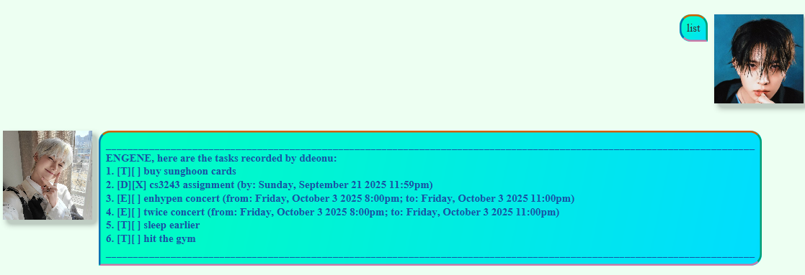

# Sunoo User Guide
Sunoo is a chatbot that helps to **manage tasks**!

Use the `help` command to view the list of commands available for use:
```java
Commands should start with the keyword; to check aliases, type "alias"!

1. List all commands: list
2. Delete a command: delete TASK_INDEX (e.g., delete 2 deletes the second task in the list)
3. Mark a command: mark TASK_INDEX (e.g., mark 1 marks the first task as done)
4. Unmark a command: unmark TASK_INDEX (e.g., unmark 1 marks the first task as not done)
5. Add a todo task: todo TASK_DESCRIPTION (e.g., todo Buy groceries)
6. Add a deadline task: deadline TASK_DESCRIPTION /by yyyy-MM-dd HH:mm
   (e.g., deadline Submit report /by 2025-09-20 23:59)
7. Add an event task: event TASK_DESCRIPTION /from yyyy-MM-dd HH:mm /to yyyy-MM-dd HH:mm
   (e.g., event Team meeting /from 2025-09-21 14:00 /to 2025-09-21 16:00)
8. Find tasks containing a keyword: find KEYWORD
9. Exit the program: bye
10. For a surprise: enhypen TITLE_TRACK
```
*Commands are case-insensitive.*
## Viewing command aliases
Shows aliases for commands. Format: `alias`
```java
Type any of the following aliases instead of the full command:

list -> l, ls, show, display
delete -> remove
mark -> m
unmark -> um
todo -> t
deadline -> d
event -> e
find -> f, fd, search, lookup
bye -> end, exit, stop, close
```
## Listing tasks
Lists all tasks in the task list currently. Format: `list`, `l`, `ls`, `show`, `display`



## Deleting tasks
Deletes the task corresponding to the index inputted. Format: `delete TASK_INDEX`, `remove TASK_INDEX`
- Example: `delete 1`, `remove 1`
- Only natural numbers are accepted as arguments, index cannot be larger than the number of current tasks.
- Tells number of tasks after the deletion.


## Marking tasks
Marks the task corresponding to the index inputted as done. Format: `mark TASK_INDEX`
- Example `mark 1`, `m 1`
- Only natural numbers are accepted as arguments, index cannot be larger than the number of current tasks.


## Unmarking tasks
Marks the task corresponding to the index inputted as not done. Format: `unmark TASK_INDEX`
- Example: `unmark 1`, `um 1`
- Only natural numbers are accepted as arguments, index cannot be larger than the number of current tasks.


## Adding todos
Adds a todo task containing its description. Format: `todo TASK_DESCRIPTION`, `t TASK_DESCRIPTION`
- Example: `todo eat breakfast`, `t eat breakfast`
- Tells number of tasks after the addition.


## Adding deadlines
Adds a deadline task containing its description and due time.
Format: `deadline TASK_DESCRIPTION /by yyyy-MM-dd HH:mm`, `d TASK_DESCRIPTION /by yyyy-MM-dd HH:mm`
- Example: `deadline CS assignment /by 2025-12-31 23:59`, `d CS assignment /by 2025-12-31 23:59`
- A `deadline` task *cannot* be added if the due date has passed.
- Tells number of tasks after the addition.


## Adding events
Adds an event task containing its description, start time and end time
Format: `event TASK_DESCRIPTION /from yyyy-MM-dd HH:mm /to yyyy-MM-dd HH:mm`, `e TASK_DESCRIPTION /from yyyy-MM-dd HH:mm /to yyyy-MM-dd HH:mm`
- Example: `event meeting /from 2025-12-01 15:00 /to 2025-12-01 16:00`, `e meeting /from 2025-12-01 15:00 /to 2025-12-01 16:00`
- An `event` task *cannot* be added if it has ended.
- An `event` task *cannot* be added if its start time is equal to or later than its end time.
- Tells number of tasks after the addition.


## Finding tasks
Finds tasks containing a keyword in its description.
Format: `find KEYWORD`, `f KEYWORD`, `fd KEYWORD`, `search KEYWORD`, `lookup KEYWORD`
- Example: `find twice`, `f twice`
- Keyword is *case-insensitive*.


## Exiting the program
Format: `bye`, `end`, `exit`, `stop`, `close`
## Special feature
Type `enhypen` followed by an ENHYPEN title track and see what happens!

